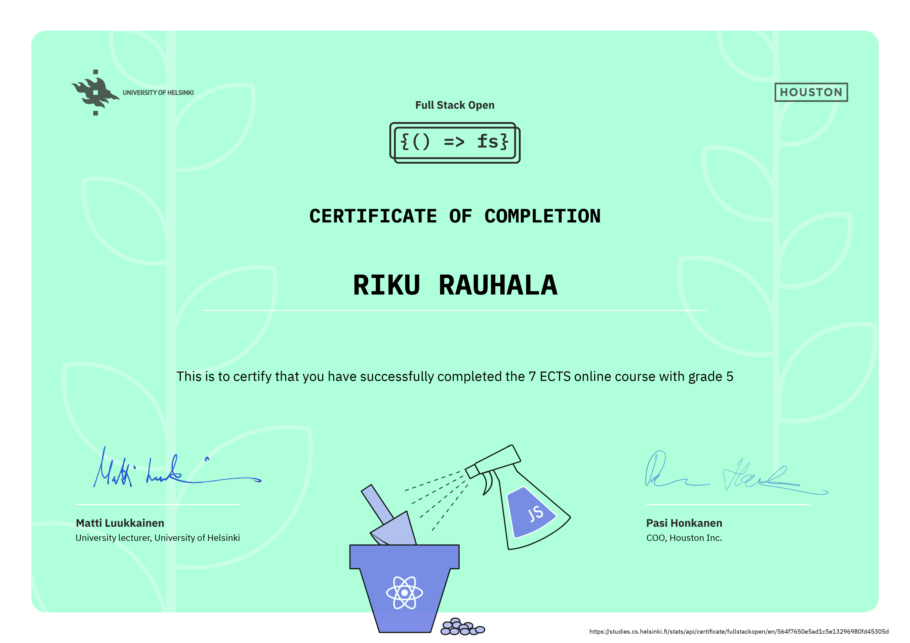

## About

My submissions for the course [Full stack open](https://fullstackopen.com/en/).

## Certificate

  
View certificate

  

 

## Progress

|                  part |                               hours | exercises | status |
| --------------------: | ----------------------------------: | --------: | :----: |
| [0](exercises/part00) |  [4](documentation/hours.md#part-0) |   6 /   6 |      ✓ |
| [1](exercises/part01) | [11](documentation/hours.md#part-1) |  14 /  14 |      ✓ |
| [2](exercises/part02) | [26](documentation/hours.md#part-2) |  20 /  20 |      ✓ |
| [3](exercises/part03) | [19](documentation/hours.md#part-3) |  22 /  22 |      ✓ |
| [4](exercises/part04) | [28](documentation/hours.md#part-4) |  23 /  23 |      ✓ |
| [5](exercises/part05) | [19](documentation/hours.md#part-5) |  22 /  22 |      ✓ |
| [6](exercises/part06) | [14](documentation/hours.md#part-6) |  21 /  21 |      ✓ |
| [7](exercises/part07) | [14](documentation/hours.md#part-7) |  12 /  21 |      ✓ |
| [8](exercises/part08) |  [0](documentation/hours.md#part-8) |   0 /  26 |        |
| [9](exercises/part09) |  [6](documentation/hours.md#part-9) |   6 /  27 |        |
|                 total |                                 141 | 146 / 202 |        |
