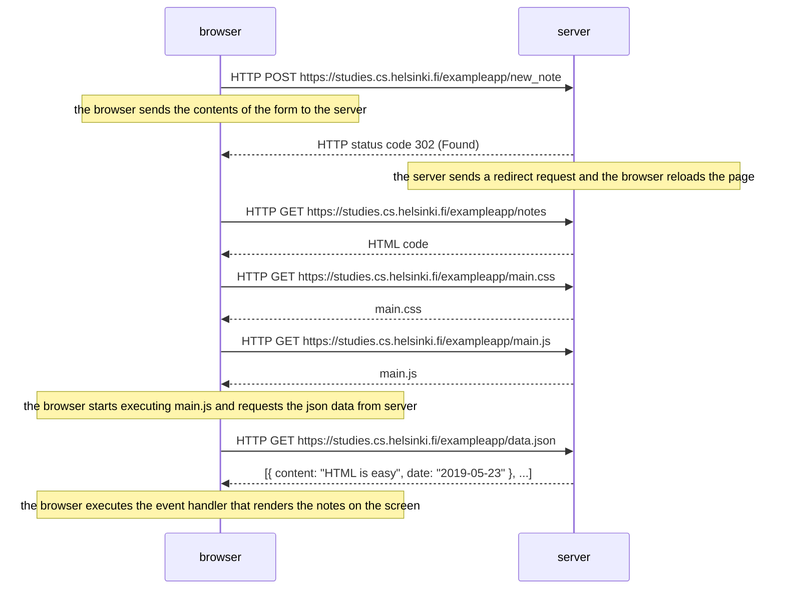
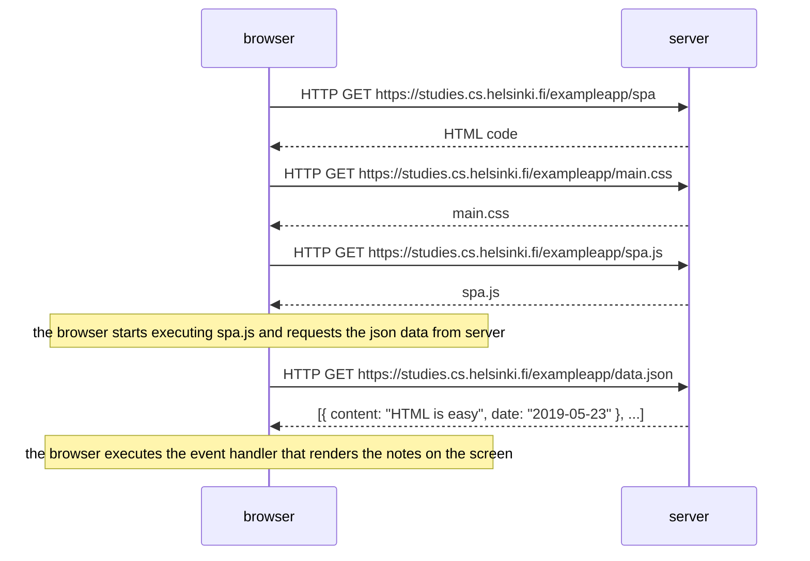
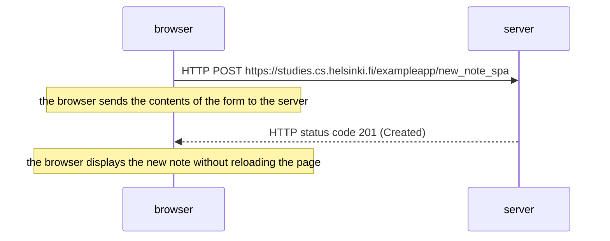

# Part 0

This directory contains the exercise files for part 0.

## Hours

Time spent: `4 hours`

## Exercises

Exercises completed: `6 / 6`

### Exercise 0.1

Tutorial reviewed on 19 May 2022.

### Exercise 0.2

Tutorial reviewed on 19 May 2022.

### Exercise 0.3

Tutorial reviewed on 19 May 2022.

### Exercise 0.4

### Exercise 0.5

### Exercise 0.6

